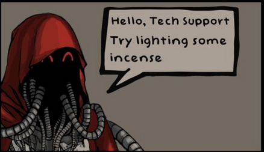

# **🛠️ Tech-Priest-Support 🛠️**

---
## A little app that gives you advice about fixing machines and electronics.

This is my frst personal project program for the Boot.Dev development course.

This program serves to entertain and provide questionable help for fixing
various devices in the tone of a Warhammer 40k Tech Priest. I do not reccomend following the advice of this program for safety reasons.

Warning: This program is not friendly.

This program is first and foremost an experiment and learning ground for me. I promise there is plenty of room for improvement.

___
## Installation and Running

Required:

  • TerminalTextEffects

  • Pillow

Running mseup.sh should automatically create the venv and install the required libraries for this. If not, please install these manually then run main.py directly.
___
